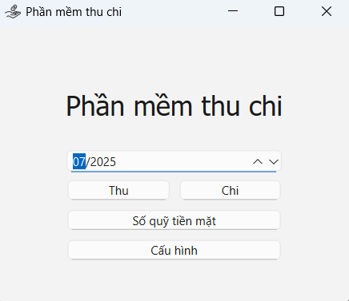

# Database Setup & Migration Guide

This project uses [Peewee ORM](https://docs.peewee-orm.com/) and [peewee-migrate](https://github.com/klen/peewee_migrate) to manage database schema migrations.

<p align="center">
  
</p>
<p align="center">
  
</p>
<p align="center">
  
</p>
---

## 📦 Installation

1. Create and activate a virtual environment:

```bash
python -m venv env
env\Scripts\activate         # Windows
# or
source env/bin/activate      # macOS/Linux
```

2. Install dependencies:

```bash
pip install peewee peewee-migrate
```

---

## 🛠️ Creating the Database and Running Migrations

### Step 1: Initialize database

```bash
python -m db.py
```
---

### Step 2: Create a migration file

After defining your models (e.g., in `models.py`), generate a migration script:

```bash
python -m peewee_migrate create `MIGRATE_NAME` --database sqlite:///app.db --auto
```

---

### Step 3: Apply the migration

```bash
python -m peewee_migrate migrate --database sqlite:///app.db
```

This applies all unapplied migrations to the database.

---

## 🔁 Other Useful Commands

| Action              | Command                                     |
|---------------------|---------------------------------------------|
| Rollback one step   | `python -m peewee_migrate rollback`         |
| List migrations     | `python -m peewee_migrate list`             |

---

## 📝 Notes

- Database file: `app.db`
- Migration folder: `migrations/`
- You do not need to manually create tables using `db.create_tables()` when using migrations.
